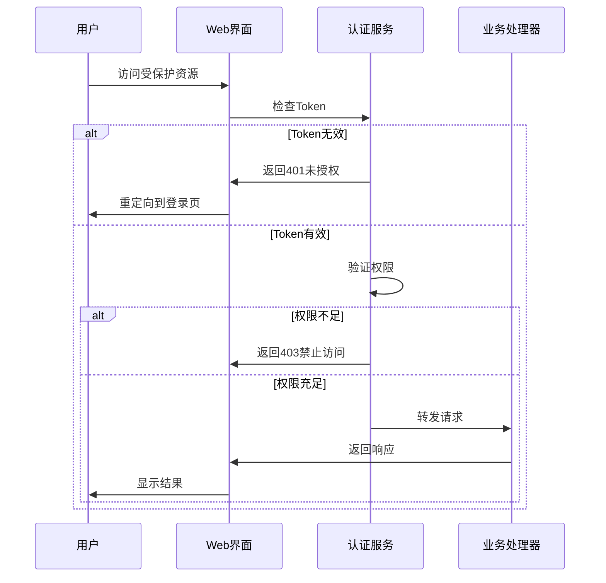

# Web安全认证系统实现报告

## 文档信息

**创建时间**: 2025年9月24日  
**更新时间**: 2025年9月24日  
**版本**: v1.0  
**作者**: DBCLI开发团队  

## 概述

为了解决DBCLI项目Web管理界面的安全问题，我们实现了完整的身份认证和授权机制。本报告详细记录了安全系统的设计、实现和部署指南。

## 安全问题分析

### 原有问题
1. **无身份认证**: Web界面完全开放，任何人都可以访问
2. **无授权控制**: 所有功能对所有用户开放
3. **CORS配置过于宽松**: 存在跨域安全风险
4. **会话管理缺失**: 无法控制用户会话和访问时长
5. **敏感操作无保护**: 配置修改、数据库操作等无安全验证

### 安全风险评估
- **风险等级**: 高危
- **影响范围**: 数据库配置泄露、未授权操作、系统被恶意控制
- **紧急程度**: 立即修复

## 安全架构设计

### 整体架构

```
┌─────────────────┐    ┌──────────────────┐    ┌─────────────────┐
│   Web前端       │───▶│  认证过滤器       │───▶│   业务处理器     │
│  (登录界面)     │    │ (Token验证)      │    │  (API Handler)  │
└─────────────────┘    └──────────────────┘    └─────────────────┘
         │                       │                       │
         ▼                       ▼                       ▼
┌─────────────────┐    ┌──────────────────┐    ┌─────────────────┐
│   Cookie/Token  │    │  权限检查        │    │   数据访问      │
│   管理          │    │ (Role-Based)     │    │  (Database)     │
└─────────────────┘    └──────────────────┘    └─────────────────┘
```

### 核心组件

#### 1. AuthenticationService (认证服务)
- **功能**: 用户登录、Token生成、会话管理
- **特性**: 
  - SHA-256密码哈希
  - 基于Token的无状态认证
  - 会话超时控制 (8小时)
  - 并发会话限制 (100个)
  - 自动清理过期会话

#### 2. AuthenticationFilter (认证过滤器)
- **功能**: 请求拦截、Token验证、权限检查
- **特性**:
  - 支持多种Token传递方式 (Header/Cookie/Query)
  - 公开路径白名单
  - CORS安全配置
  - 统一错误响应

#### 3. UserRole (用户角色)
- **ADMIN**: 管理员 - 拥有所有权限
- **OPERATOR**: 操作员 - 部分操作权限
- **USER**: 普通用户 - 只读权限

#### 4. SecureWebManagementServer (安全Web服务器)
- **功能**: 集成认证的Web服务器
- **特性**:
  - 路径级别的权限控制
  - 安全的登录/登出流程
  - 用户管理界面
  - 管理员功能

## 实现细节

### 认证流程



### 权限控制矩阵

| 资源类型 | 操作 | ADMIN | OPERATOR | USER |
|---------|------|-------|----------|------|
| 配置管理 | 读取 | ✅ | ✅ | ✅ |
| 配置管理 | 修改 | ✅ | ✅ | ❌ |
| 配置管理 | 删除 | ✅ | ❌ | ❌ |
| 数据库连接 | 测试 | ✅ | ✅ | ❌ |
| 报告生成 | 生成 | ✅ | ✅ | ❌ |
| 报告查看 | 查看 | ✅ | ✅ | ✅ |
| 用户管理 | 管理 | ✅ | ❌ | ❌ |
| 系统管理 | 管理 | ✅ | ❌ | ❌ |

### 安全特性

#### 1. 密码安全
- **哈希算法**: SHA-256
- **默认密码**: admin123 (生产环境必须修改)
- **密码策略**: 建议8位以上，包含字母数字

#### 2. Token安全
- **生成方式**: 用户名 + 时间戳 + 随机数 + Base64编码
- **传输方式**: HTTP Header (Authorization: Bearer) 或 HttpOnly Cookie
- **有效期**: 8小时
- **存储**: 内存存储 (生产环境建议Redis)

#### 3. 会话安全
- **超时控制**: 8小时自动过期
- **并发限制**: 最多100个活跃会话
- **自动清理**: 每5分钟清理过期会话
- **IP记录**: 记录登录IP用于审计

#### 4. CORS安全
- **允许来源**: 可配置 (当前为*)
- **允许方法**: GET, POST, PUT, DELETE, OPTIONS
- **允许头部**: Content-Type, Authorization, X-Requested-With
- **凭证支持**: 支持Cookie传递

## 部署配置

### 1. 启动安全Web服务器

```java
// 替换原有的WebManagementServer
SecureWebManagementServer server = new SecureWebManagementServer(8080);
server.start();
```

### 2. 默认管理员账户

```
用户名: admin
密码: admin123
角色: ADMIN
```

**⚠️ 重要**: 生产环境部署前必须修改默认密码！

### 3. 环境配置

#### 开发环境
```properties
# 开发环境配置
web.port=8080
auth.session.timeout=8h
auth.max.sessions=100
cors.allowed.origins=*
```

#### 生产环境
```properties
# 生产环境配置
web.port=8443
web.ssl.enabled=true
web.ssl.keystore=/path/to/keystore.jks
auth.session.timeout=4h
auth.max.sessions=50
cors.allowed.origins=https://your-domain.com
```

## 使用指南

### 1. 用户登录

访问 `http://localhost:8080/login` 进行登录：

- 输入用户名和密码
- 系统验证身份并生成Token
- Token保存在HttpOnly Cookie中
- 自动跳转到管理界面

### 2. API访问

所有受保护的API都需要在请求头中包含Token：

```bash
# 使用Authorization头
curl -H "Authorization: Bearer YOUR_TOKEN" http://localhost:8080/api/status

# 或使用Cookie (浏览器自动处理)
curl -b "dbcli-token=YOUR_TOKEN" http://localhost:8080/api/status
```

### 3. 权限管理

管理员可以通过 `/api/admin` 接口管理用户和会话：

```bash
# 查看会话统计
curl -H "Authorization: Bearer ADMIN_TOKEN" http://localhost:8080/api/admin

# 添加用户 (开发中)
curl -X POST -H "Authorization: Bearer ADMIN_TOKEN" \
     -d '{"username":"newuser","password":"password","role":"USER"}' \
     http://localhost:8080/api/admin
```

### 4. 密码修改

用户可以通过 `/api/user` 接口修改密码：

```bash
curl -X POST -H "Authorization: Bearer USER_TOKEN" \
     -d '{"oldPassword":"old","newPassword":"new"}' \
     http://localhost:8080/api/user
```

## 安全最佳实践

### 1. 部署前检查清单

- [ ] 修改默认管理员密码
- [ ] 配置HTTPS (生产环境)
- [ ] 限制CORS允许来源
- [ ] 配置防火墙规则
- [ ] 启用访问日志
- [ ] 定期备份用户数据

### 2. 运维建议

#### 监控指标
- 登录失败次数
- 活跃会话数量
- 异常IP访问
- API调用频率

#### 日志审计
- 用户登录/登出记录
- 权限验证失败记录
- 敏感操作记录
- 系统异常记录

#### 定期维护
- 清理过期会话
- 更新安全补丁
- 审查用户权限
- 备份配置数据

### 3. 安全加固建议

#### 短期 (1-2周)
1. **启用HTTPS**: 配置SSL证书，强制HTTPS访问
2. **IP白名单**: 限制管理界面访问IP范围
3. **登录限制**: 实现登录失败锁定机制
4. **审计日志**: 完善操作审计和日志记录

#### 中期 (1-2月)
1. **双因子认证**: 集成TOTP或短信验证
2. **单点登录**: 集成企业SSO系统
3. **权限细化**: 实现更细粒度的权限控制
4. **安全扫描**: 定期进行安全漏洞扫描

#### 长期 (3-6月)
1. **零信任架构**: 实现零信任网络访问
2. **行为分析**: 用户行为异常检测
3. **自动化运维**: 安全事件自动响应
4. **合规认证**: 通过相关安全合规认证

## 测试验证

### 1. 功能测试

```bash
# 测试登录
curl -X POST -d '{"username":"admin","password":"admin123"}' \
     -H "Content-Type: application/json" \
     http://localhost:8080/api/login

# 测试受保护资源
curl -H "Authorization: Bearer TOKEN" \
     http://localhost:8080/api/status

# 测试权限控制
curl -H "Authorization: Bearer USER_TOKEN" \
     -X POST http://localhost:8080/api/config-delete
```

### 2. 安全测试

```bash
# 测试未授权访问
curl http://localhost:8080/api/config

# 测试无效Token
curl -H "Authorization: Bearer invalid_token" \
     http://localhost:8080/api/status

# 测试CORS
curl -H "Origin: http://malicious-site.com" \
     -H "Access-Control-Request-Method: POST" \
     -X OPTIONS http://localhost:8080/api/login
```

## 问题排查

### 常见问题

#### 1. 登录失败
- **症状**: 用户名密码正确但登录失败
- **排查**: 检查日志中的登录记录，确认密码哈希是否正确
- **解决**: 重置密码或检查用户状态

#### 2. Token过期
- **症状**: 频繁要求重新登录
- **排查**: 检查Token有效期配置和系统时间
- **解决**: 调整会话超时时间或检查时钟同步

#### 3. 权限不足
- **症状**: 403 Forbidden错误
- **排查**: 检查用户角色和API权限配置
- **解决**: 调整用户角色或API权限设置

#### 4. CORS错误
- **症状**: 浏览器跨域请求被阻止
- **排查**: 检查CORS配置和请求来源
- **解决**: 调整CORS允许来源配置

### 日志分析

```bash
# 查看认证相关日志
grep "Authentication" logs/application.log

# 查看登录失败记录
grep "登录失败" logs/application.log

# 查看权限验证记录
grep "权限" logs/application.log
```

## 总结

通过实施完整的身份认证和授权机制，DBCLI项目的Web管理界面安全性得到了显著提升：

### 安全改进
1. ✅ **身份认证**: 基于Token的安全认证机制
2. ✅ **权限控制**: 基于角色的访问控制 (RBAC)
3. ✅ **会话管理**: 安全的会话生命周期管理
4. ✅ **CORS保护**: 配置化的跨域访问控制
5. ✅ **审计日志**: 完整的操作审计记录

### 用户体验
1. ✅ **友好界面**: 现代化的登录和管理界面
2. ✅ **自动跳转**: 智能的登录状态检测和跳转
3. ✅ **错误提示**: 清晰的错误信息和用户指导
4. ✅ **响应式设计**: 支持多种设备访问

### 运维支持
1. ✅ **配置灵活**: 支持多环境配置
2. ✅ **监控完善**: 丰富的监控指标和统计
3. ✅ **日志详细**: 完整的操作和安全日志
4. ✅ **扩展性好**: 易于集成和扩展

**建议**: 在生产环境部署前，请务必完成安全加固清单中的所有项目，确保系统安全可靠运行。

---

**文档维护**: 本文档将随着系统升级持续更新，请关注最新版本。  
**技术支持**: 如有问题请联系DBCLI开发团队。